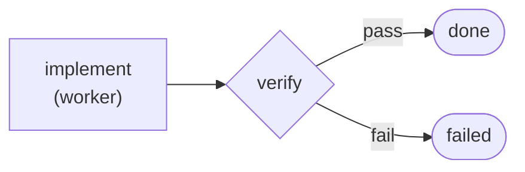
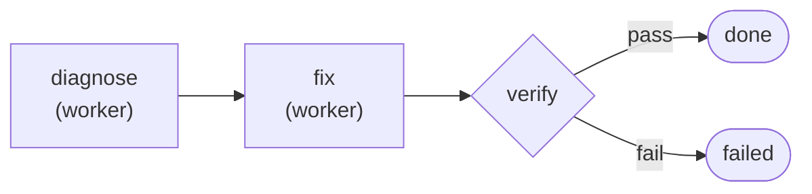
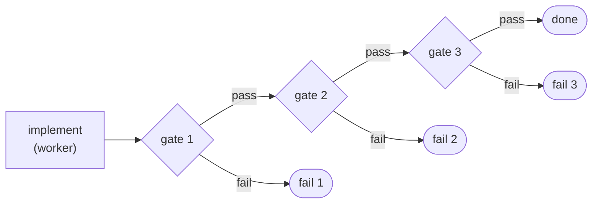
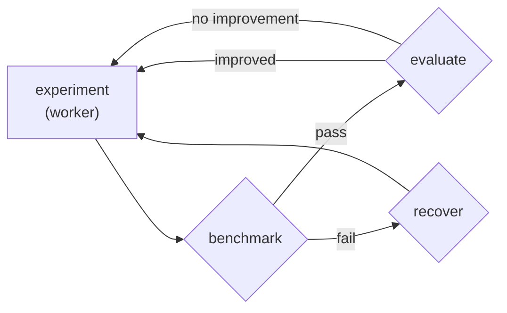
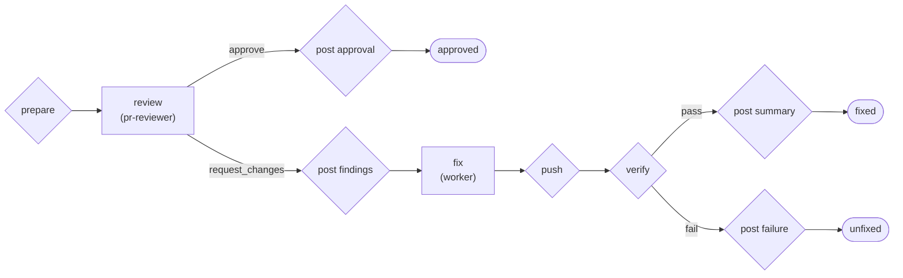

# pi-relay

Workflow engine for [pi](https://pi.dev/) — break complex tasks into steps with actors, commands, and loops.

For simple tasks, pi works in a single shot. But for anything that needs verification — implement, test, fix what broke, test again — you end up driving the loop yourself. You run the tests, paste the failure back, ask for a fix, re-check, and repeat. There's no structured way to route on success or failure, and no separation between the role that writes code and the role that reviews it.

Relay eliminates that. You define the workflow once — steps, actors, verification gates, routing — and relay executes it.

The simplest useful example — do the work, then prove it didn't break anything:



```
pi> Use replay with the verified-edit template:
  task: Add input validation to the signup handler in src/api/signup.ts
  verify: npm test
```

A worker actor implements the change. A shell command runs the tests. Exit 0 routes to success, non-zero routes to failure. One actor, one gate, no ambiguity.

That's one topology. These are the plan templates bundled with relay:

| Topology | What it models |
|----------|---------------|
| act → verify | Gated commit |
| diagnose → fix → verify | Root cause analysis |
| act → review → fix ↺ | Iterative QA |
| act → gate₁ → gate₂ → gate₃ | Sequential checks |
| argue → challenge → judge ↺ | Structured debate |
| propose → benchmark → evaluate ↺ | Optimization loop |
| review → post → fix → verify | AI code review (CI) |

The ↺ arrows are back-edges — loops where a step routes to an earlier step, capped by `max_runs` to prevent runaway execution. Every row is a different shape built from the same building blocks — actors that do work, shell commands that check results, and routing that connects them. You can write your own templates for any topology your workflow needs. The topology is the program.

## Getting started: extension

```bash
pi install https://github.com/benaiad/pi-relay
```

Or install manually:

```bash
# Copy
cp -r . ~/.pi/agent/extensions/pi-relay/
cd ~/.pi/agent/extensions/pi-relay && npm install --omit=dev

# Or symlink (changes take effect immediately)
ln -s "$(pwd)" ~/.pi/agent/extensions/pi-relay
```

Three things are added to pi:

- **`relay` tool** — the assistant designs and executes a one-off plan: steps, actors, artifacts, verification gates.
- **`replay` tool** — the assistant runs a saved plan template by name with arguments.
- **`/relay` command** — interactive TUI to browse, enable, and disable actors and templates.

When a plan can modify files or run commands, pi shows a review before execution — **run**, **refine**, or **cancel**. Read-only plans skip the review.

```
pi> Use replay with the reviewed-edit template:
  task: Add rate limiting to the /api/upload endpoint
  criteria: Returns 429 after 10 requests per minute per IP. Includes Retry-After header.
  verify: npm test && npm run lint
```

## Getting started: CLI

Run plan templates headlessly — no interaction, no prompts. Point at a template, pass parameters, get a report.

```bash
npm install -g github:benaiad/pi-relay
```

This gives you the `relay` command. Dependencies are installed automatically.

```bash
relay plans/verified-edit.md -e task="Fix the bug" -e verify="npm test" --model deepseek/deepseek-v4-pro
```

Exit 0 on success, non-zero on failure.

```yaml
# GitHub Actions
- run: npm install -g github:benaiad/pi-relay
- run: relay plans/verified-edit.md -e task="Fix the bug" -e verify="npm test" --model deepseek/deepseek-v4-pro
  env:
    DEEPSEEK_API_KEY: ${{ secrets.DEEPSEEK_API_KEY }}
```

<details>
<summary><strong>CLI reference</strong> — options, defaults, working directory, dry run</summary>

### Options

```
relay <template.md> [-e key=value]... [options]

-e key=value              Set a template parameter
-e @file.json             Load parameters from JSON file
--model <provider/name>   Default model for actors without model config
--thinking <level>        Default thinking level (default: off)
--actors-dir <path>       Directory containing actor .md files
--dry-run                 Validate and show the compiled plan, then exit
```

`--model` and `--thinking` are fallbacks for actors that don't declare their own. If an actor has `model:` in its frontmatter, it uses that. If not, it uses `--model`. No model anywhere = error.

### Parameter defaults

Template parameters can declare defaults in their frontmatter. A parameter without `default` is required — the CLI will error if you don't provide it with `-e`.

```bash
# verified-edit declares verify with default: "npm test"
# so only task is required here
relay plans/verified-edit.md -e task="Fix the bug" --model deepseek/deepseek-v4-pro
```

### Working directory

Templates can declare a `cwd` field to set the working directory for all steps. Pass it like any other parameter:

```bash
relay plans/api-fix.md -e task="Fix auth" -e cwd=packages/api --model deepseek/deepseek-v4-pro
```

### Dry run

Validate without running — no LLM calls, no API key needed:

```bash
relay plans/verified-edit.md -e task="Fix it" -e verify="npm test" --dry-run
```

</details>

## How it works

### Steps and routing

A plan is a DAG of steps. Four types:

- **`action`** — an actor (LLM agent) runs with a restricted tool set and emits a route on completion.
- **`command`** — runs a shell command. Pass if exit 0, fail otherwise. Output is captured for the failure reason. Reads artifacts from `$RELAY_INPUT`, writes artifacts to `$RELAY_OUTPUT`.
- **`files_exist`** — checks that all listed paths exist on the filesystem.
- **`terminal`** — ends the run with a declared outcome: success or failure.

Action steps declare a map of route names to target steps:

```yaml
routes: { done: verify, failure: failed }
```

The actor chooses which route to emit on completion. Multi-way branching is supported — a judge step might route to `resolved` or `unresolved`, each pointing to a different next step.

Command and files_exist steps route via fixed `on_success` / `on_failure` fields.

Commands run through pi's shell backend (respects `shellPath` in settings, defaults to `/bin/bash` on Unix, Git Bash on Windows). Integer and boolean parameters are coerced automatically.

### Artifacts

Structured state passed between steps. Declared at the plan level with a name and description, then read and written by steps. Action steps read and write artifacts through a terminating tool call. Command steps read and write artifacts through the filesystem:

```yaml
- type: command
  name: grade
  command: "./grader.sh"
  reads: [candidate]
  writes: [evaluation]
  on_success: done
  on_failure: propose
```

The runtime creates two directories and sets `$RELAY_INPUT` and `$RELAY_OUTPUT` as env vars. Both use the same interface — files named after artifact ids:

```bash
# grader.sh — read from $RELAY_INPUT, write to $RELAY_OUTPUT
candidate=$(cat "$RELAY_INPUT/candidate")
echo "$candidate" | ./run-challenges.sh > "$RELAY_OUTPUT/evaluation"
```

Format: plain text (no fields), JSON object (fields), JSON array (fields + list). Both directories are created by the runtime — do not mkdir them.

Artifacts can optionally declare `fields` (named keys the value must contain) and `list: true` (value is an array of objects with those fields). The runtime validates committed values against the declared shape and enforces that only declared writers commit. Artifacts accumulate across loop iterations with attribution metadata.

### Loops

Routes can point to earlier steps, creating loops. A command step that fails can route back to an action step, which re-runs with the failure reason in its prompt. The `max_runs` field on action steps caps iterations to prevent runaway loops.

## Templates

Plan templates are reusable workflow definitions — the assistant runs them via `replay`, and the CLI runs them via `relay`. Same templates, both modes. The following ship with relay:

### verified-edit

The simplest topology, shown above. Do the work, then prove it didn't break anything.

**Parameters:** `task`, `verify`

```
pi> Use replay with the verified-edit template:
  task: Add input validation to the signup handler in src/api/signup.ts
  verify: npm test
```

### reviewed-edit

Two-pass review with a fix loop. Spec compliance first, code quality second. Reviewers run in fresh contexts — no memory of the implementation reasoning, so they evaluate the code as-is.


**Parameters:** `task`, `criteria`, `verify`

```
pi> Use replay with the reviewed-edit template:
  task: Refactor the auth middleware to support both JWT and session tokens
  criteria: Existing session-based tests still pass. JWT tokens are validated with the public key from JWKS endpoint. No hardcoded secrets.
  verify: npm test && npm run lint
```

<details>
<summary><strong>bug-fix</strong> — diagnosis before code changes</summary>

The worker writes a structured root-cause analysis to an artifact, then reads it back when fixing. No "let me just try something."



**Parameters:** `bug`, `verify`

```
pi> Use replay with the bug-fix template:
  bug: Login returns 500 when email contains a + character
  verify: npm test -- --grep auth
```

</details>

<details>
<summary><strong>multi-gate</strong> — sequential verification gates</summary>

Three sequential verification gates with per-gate failure reporting. Use instead of `verified-edit` when you need to know exactly which gate failed — a compound `lint && tsc && test` command hides which step broke.



**Parameters:** `task`, `gate1`, `gate1_name`, `gate2`, `gate2_name`, `gate3`, `gate3_name`

```
pi> Use replay with the multi-gate template:
  task: Refactor the config parser to use Zod schemas
  gate1: npm run lint
  gate1_name: lint
  gate2: npx tsc --noEmit
  gate2_name: typecheck
  gate3: npm test
  gate3_name: test
```

</details>

<details>
<summary><strong>debate</strong> — structured adversarial debate</summary>

Structured adversarial debate between three actors. The advocate defends a position, the critic attacks it, and the judge decides whether the question is resolved or needs another round. The loop runs up to `max_rounds` iterations.


**Parameters:** `topic`, `position`, `max_rounds`

```
pi> Use replay with the debate template:
  topic: Should we migrate from REST to GraphQL for the users API?
  position: Yes — GraphQL eliminates overfetching and simplifies the mobile client.
  max_rounds: 3
```

</details>

<details>
<summary><strong>autoresearch</strong> — autonomous optimization loop</summary>

An autonomous optimization loop that demonstrates back-edges with `max_runs` for iteration capping. The agent modifies code, the runtime benchmarks it, a deterministic gate keeps improvements and reverts regressions. Included as an example in [`examples/autoresearch/`](examples/autoresearch/) — see its README for setup.



**Parameters:** `target`, `goal`, `benchmark`, `evaluate`, `recover`, `max_experiments`

</details>

<details>
<summary><strong>pr-review</strong> — AI code review for pull requests</summary>

AI code review for pull requests, designed for CI. A reviewer LLM reads the diff, produces structured findings, and the runtime posts them as a GitHub review with line-level inline comments. A worker LLM then fixes findings and pushes a verified commit. Two LLM calls — all GitHub interaction via bash scripts. Included in [`bundled/ci/`](bundled/ci/) — see its [README](bundled/ci/README.md) for setup.



**Parameters:** `pr_number`, `verify`, `max_diff_lines`, `base_branch`

```bash
# GitHub Actions (see bundled/ci/README.md for full workflow)
relay bundled/ci/pr-review.md \
  -e pr_number=42 \
  --model "$RELAY_MODEL" --thinking "${RELAY_THINKING:-off}"

# Local testing
RELAY_PLAN_DIR=./bundled/ci relay bundled/ci/pr-review.md \
  -e pr_number=42 -e base_branch=main \
  --model deepseek/deepseek-v4-pro --thinking medium
```

</details>

## Custom templates

To add your own templates or override a bundled one, place `.md` files in:

- **User scope:** `~/.pi/agent/pi-relay/plans/` — available in all projects
- **Project scope:** `<project>/.pi/pi-relay/plans/` — available only in that project

A custom template with the same `name:` as a bundled one shadows it. Project scope shadows user scope. Example:

```markdown
---
name: my-workflow
description: "What this does and when to use it."
parameters:
  - name: task
    description: What to implement.
  - name: verify
    description: Shell command that must exit 0.
---

task: "{{task}}"
steps:
  - type: action
    name: implement
    actor: worker
    instruction: "{{task}}"
    routes: { done: verify }
  - type: command
    name: verify
    command: "{{verify}}"
    on_success: done
    on_failure: failed
  - type: terminal
    name: done
    outcome: success
    summary: Done.
  - type: terminal
    name: failed
    outcome: failure
    summary: Verification failed.
```

## Actors

Actors define the roles that execute action steps. The following ship with the extension:

- **worker** — implements changes (read, edit, write, grep, find, ls, bash)
- **reviewer** — reviews against criteria, read-only (read, grep, find, ls, bash)
- **advocate** — argues a position in a debate (read, grep, find, ls)
- **critic** — challenges arguments in a debate (read, grep, find, ls)
- **judge** — evaluates debate rounds and delivers verdicts (read, grep, find, ls)

To add custom actors or override a bundled one, place `.md` files in:

- **User scope:** `~/.pi/agent/pi-relay/actors/` — available in all projects
- **Project scope:** `<project>/.pi/pi-relay/actors/` — available only in that project

Same shadowing rules as templates. Example:

```markdown
---
name: security-auditor
description: Scans code for security vulnerabilities
tools: read, grep, find, ls
---

You are a security auditor. Read the code carefully and report
any vulnerabilities, focusing on injection, auth bypass, and
data exposure.
```

Edits to actor system prompts take effect on the next execution. Adding or removing actors requires `/reload`. Use `/relay` to toggle actors on or off — disabling an actor automatically disables templates that use it.

## Development

```bash
git clone https://github.com/benaiad/pi-relay.git
cd pi-relay && npm install && pi install .
npm test              # run tests
npm run check         # typecheck + lint (tsc + biome)
npm run format        # auto-format (biome, tabs, width 3)
```

## License

MIT
