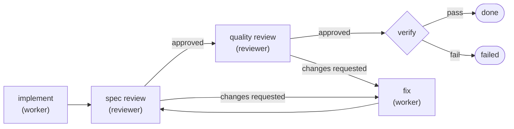
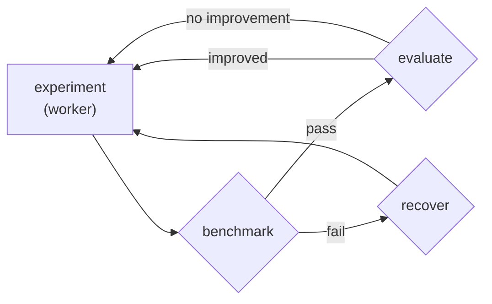

# pi-relay

Workflow engine for [Pi](https://pi.dev/) — break complex tasks into steps with actors, commands, and loops.

For simple tasks, Pi works in a single shot. But for anything that needs verification — implement, test, fix what broke, test again — the agent drives the loop ad hoc. It decides when to re-run tests, whether to retry or give up, and how many attempts are too many. There's no structured way to route on success or failure, no separation between the role that writes code and the role that reviews it, and no cap on how long it spins.

## Harness the Harness

The code change is one step. The verification loop is the system.

Instead of babysitting `implement → test → fix → test again`, you describe the control flow once: who acts, what command checks the result, where failures go, and how many times a loop may run. Relay executes the loop, carries the artifacts forward, and stops at a declared outcome.

The simplest useful example — do the work, then prove it didn't break anything:


```text
pi> Use replay with the verified-edit template:
  task: Add input validation to the signup handler in src/api/signup.ts
  verify: npm test
```

A worker actor implements the change. A shell command runs the tests. Exit `0` routes to success; non-zero routes to failure. One actor, one gate, no ambiguity.

## When to use Relay

Use Relay when a task has more structure than "ask once and hope":

- the result must pass a command such as `npm test`, `tsc`, a linter, or a benchmark
- success and failure should route to different next steps
- one actor should write code while another reviews it
- state needs to move between steps as explicit artifacts
- a loop should retry until it passes, but only up to a limit
- the same workflow should run from Pi, the CLI, or CI

For simple one-shot tasks, use Pi directly. For tasks with gates, roles, retries, or repeatable process, use Relay.

## Install as a Pi extension

```bash
pi install https://github.com/benaiad/pi-relay
```

Or install manually:

```bash
# Copy
cp -r . ~/.pi/agent/extensions/pi-relay/
cd ~/.pi/agent/extensions/pi-relay && npm install --omit=dev

# Or symlink while developing
ln -s "$(pwd)" ~/.pi/agent/extensions/pi-relay
```

Relay adds three things to Pi:

| Name | What it does |
|---|---|
| `relay` tool | Designs and executes a one-off workflow plan. |
| `replay` tool | Runs a saved plan template by name with arguments. |
| `/relay` command | Slash command to browse, enable, and disable actors and templates. |

When a plan can modify files or run commands, Pi shows a review before execution: **run**, **refine**, or **cancel**. Read-only plans skip that review.

## First run

Use the bundled `verified-edit` template to make a change and prove it still passes verification:

```text
pi> Use replay with the verified-edit template:
  task: Add input validation to the signup handler in src/api/signup.ts
  verify: npm test
```

That compiles to a small plan:

1. `implement` — the `worker` actor edits the code.
2. `verify` — Relay runs `npm test`.
3. `done` or `failed` — Relay exits with a declared outcome.

For a stricter workflow, use review plus verification:

```text
pi> Use replay with the reviewed-edit template:
  task: Add rate limiting to the /api/upload endpoint
  criteria: Returns 429 after 10 requests per minute per IP. Includes Retry-After header.
  verify: npm test && npm run lint
```

## Bundled templates

Every template is a different topology built from the same primitives: actors, commands, artifacts, routes, and terminal outcomes. The topology is the program.

| Topology | Use it for | Template |
|---|---|---|
| `act → verify` | Make a change, then prove it passes. | [`verified-edit`](bundled/plans/verified-edit.md) |
| `diagnose → fix → verify` | Debug from a written root-cause analysis. | [`bug-fix`](bundled/plans/bug-fix.md) |
| `act → review → fix ↺` | Iterate through spec and quality review. | [`reviewed-edit`](bundled/plans/reviewed-edit.md) |
| `act → gate₁ → gate₂ → gate₃` | Run sequential checks with separate failure reporting. | [`multi-gate`](bundled/plans/multi-gate.md) |
| `argue → challenge → judge ↺` | Run structured adversarial debate. | [`debate`](bundled/plans/debate.md) |
| `propose → benchmark → evaluate ↺` | Search for improvements with deterministic evaluation. | [`autoresearch`](bundled/examples/autoresearch/) |
| `review → post → fix → verify` | Review and fix GitHub pull requests in CI. | [`pr-review`](bundled/ci/pr-review.md) |

The `↺` arrows are back-edges — loops where a step routes to an earlier step, capped by `max_runs` to prevent runaway execution. Every row is a different shape built from the same building blocks.

## Template examples

### `verified-edit`

The simplest topology. Do the work, then prove it didn't break anything.

**Parameters:** `task`, `verify`

```text
pi> Use replay with the verified-edit template:
  task: Add input validation to the signup handler in src/api/signup.ts
  verify: npm test
```

### `reviewed-edit`

Two-pass review with a fix loop. Spec compliance first, code quality second. Reviewers run in fresh contexts — no memory of the implementation reasoning, so they evaluate the code as-is.



**Parameters:** `task`, `criteria`, `verify`

```text
pi> Use replay with the reviewed-edit template:
  task: Refactor the auth middleware to support both JWT and session tokens
  criteria: Existing session-based tests still pass. JWT tokens are validated with the public key from JWKS endpoint. No hardcoded secrets.
  verify: npm test && npm run lint
```

<details>
<summary><strong>More bundled templates</strong></summary>

### `bug-fix`

The worker writes a structured root-cause analysis to an artifact, then reads it back when fixing. No "let me just try something."


**Parameters:** `bug`, `verify`

```text
pi> Use replay with the bug-fix template:
  bug: Login returns 500 when email contains a + character
  verify: npm test -- --grep auth
```

### `multi-gate`

Three sequential verification gates with per-gate failure reporting. Use instead of `verified-edit` when you need to know exactly which gate failed — a compound `lint && tsc && test` command hides which step broke.


**Parameters:** `task`, `gate1`, `gate1_name`, `gate2`, `gate2_name`, `gate3`, `gate3_name`

```text
pi> Use replay with the multi-gate template:
  task: Refactor the config parser to use Zod schemas
  gate1: npm run lint
  gate1_name: lint
  gate2: npx tsc --noEmit
  gate2_name: typecheck
  gate3: npm test
  gate3_name: test
```

### `debate`

Structured adversarial debate between three actors. The advocate defends a position, the critic attacks it, and the judge decides whether the question is resolved or needs another round. The loop runs up to `max_rounds` iterations.


**Parameters:** `topic`, `position`, `max_rounds`

```text
pi> Use replay with the debate template:
  topic: Should we migrate from REST to GraphQL for the users API?
  position: Yes — GraphQL eliminates overfetching and simplifies the mobile client.
  max_rounds: 3
```

### `autoresearch`

An autonomous optimization loop that demonstrates back-edges with `max_runs` for iteration capping. The agent modifies code, the runtime benchmarks it, a deterministic gate keeps improvements and reverts regressions. Included as an example in [`examples/autoresearch/`](examples/autoresearch/) — see its README for setup.



**Parameters:** `target`, `goal`, `benchmark`, `evaluate`, `recover`, `max_experiments`

### `pr-review`

AI code review for pull requests, designed for CI. A reviewer LLM reads the diff, produces structured findings, and the runtime posts them as a GitHub review with line-level inline comments. A worker LLM then fixes findings and pushes a verified commit. Two LLM calls — all GitHub interaction via bash scripts. Included in [`bundled/ci/`](bundled/ci/) — see its [README](bundled/ci/README.md) for setup.


**Parameters:** `pr_number`, `verify`, `max_diff_lines`, `base_branch`

```bash
# GitHub Actions (see bundled/ci/README.md for full workflow)
relay bundled/ci/pr-review.md \
  -e pr_number=42 \
  --model "$RELAY_MODEL" --thinking "${RELAY_THINKING:-off}"

# Local testing
RELAY_PLAN_DIR=./bundled/ci relay bundled/ci/pr-review.md \
  -e pr_number=42 -e base_branch=main \
  --model deepseek/deepseek-v4-pro --thinking medium
```

</details>

## CLI

Install the command-line runner:

```bash
npm install -g github:benaiad/pi-relay
```

Run a plan template headlessly — no interaction, no prompts. Point at a template, pass parameters, get a report.

```bash
relay plans/verified-edit.md \
  -e task="Fix the bug" \
  -e verify="npm test" \
  --model deepseek/deepseek-v4-pro
```

The CLI exits `0` on success and non-zero on failure, so it works naturally in scripts and CI.

```yaml
# GitHub Actions
- run: npm install -g github:benaiad/pi-relay
- run: relay plans/verified-edit.md -e task="Fix the bug" -e verify="npm test" --model deepseek/deepseek-v4-pro
  env:
    DEEPSEEK_API_KEY: ${{ secrets.DEEPSEEK_API_KEY }}
```

<details>
<summary><strong>CLI reference</strong></summary>

```text
relay <template.md> [-e key=value]... [options]

-e key=value              Set a template parameter
-e @file.json             Load parameters from JSON file
--model <provider/name>   Default model for actors without model config
--thinking <level>        Default thinking level (default: off)
--actors-dir <path>       Directory containing actor .md files
--dry-run                 Validate and show the compiled plan, then exit
```

`--model` and `--thinking` are fallbacks. If an actor declares `model:` in frontmatter, that actor uses its own model. If not, it uses `--model`. If neither is set, the CLI errors.

### Parameter defaults

Templates can define defaults in frontmatter. Parameters without defaults are required.

```bash
# verified-edit declares verify with default: "npm test",
# so only task is required here.
relay plans/verified-edit.md \
  -e task="Fix the bug" \
  --model deepseek/deepseek-v4-pro
```

### Working directory

Templates can accept a `cwd` parameter and apply it to every step:

```bash
relay plans/api-fix.md \
  -e task="Fix auth" \
  -e cwd=packages/api \
  --model deepseek/deepseek-v4-pro
```

### Dry run

Validate without LLM calls or API keys:

```bash
relay plans/verified-edit.md \
  -e task="Fix it" \
  -e verify="npm test" \
  --dry-run
```

</details>

## How Relay works

A Relay plan is a directed graph of steps. Each step runs, emits a route, and hands control to the next step.

### Step types

| Type | Purpose |
|---|---|
| `action` | Runs an actor, such as `worker` or `reviewer`, with a restricted tool set. The actor emits a named route when it finishes. |
| `command` | Runs a shell command. Exit `0` follows `on_success`; non-zero follows `on_failure`. Output is captured for the failure reason. |
| `files_exist` | Checks that required files exist and routes on pass/fail. |
| `terminal` | Ends the run with a declared `success` or `failure` outcome. |

Commands run through Pi's shell backend (respects `shellPath` in settings, defaults to `/bin/bash` on Unix, Git Bash on Windows). Integer and boolean parameters are coerced automatically.

### Routing

Action steps declare named routes:

```yaml
routes: { done: verify, failure: failed }
```

The actor chooses which route to emit on completion. Multi-way branching is supported — a judge step might route to `resolved` or `unresolved`, each pointing to a different next step.

Command and `files_exist` steps use fixed pass/fail routes:

```yaml
on_success: done
on_failure: fix
```

Routes can point forward or backward. A backward route creates a loop; `max_runs` caps how many times an action step can run.

### Artifacts

Artifacts are structured state passed between steps. A plan declares artifacts once, then steps read and write them.

Action steps commit artifacts through their terminating tool call. Command steps read artifacts from `$RELAY_INPUT` and write artifacts to `$RELAY_OUTPUT`.

```yaml
- type: command
  name: grade
  command: "./grader.sh"
  reads: [candidate]
  writes: [evaluation]
  on_success: done
  on_failure: propose
```

A command reads and writes files named after artifact IDs:

```bash
# grader.sh
candidate=$(cat "$RELAY_INPUT/candidate")
echo "$candidate" | ./run-challenges.sh > "$RELAY_OUTPUT/evaluation"
```

Relay creates both directories. Do not create them yourself.

Artifact values may be plain text (no fields), JSON objects (declared fields), or JSON arrays (declared fields with `list: true`). The runtime validates committed values against the declared shape, enforces that only declared writers commit, and preserves loop-iteration history with attribution metadata.

## Custom templates

Add project-specific or user-wide templates as Markdown files:

| Scope | Directory |
|---|---|
| User | `~/.pi/agent/pi-relay/plans/` |
| Project | `<project>/.pi/pi-relay/plans/` |

Project templates shadow user templates. User templates shadow bundled templates. A custom template with the same `name:` as a bundled template replaces it.

Example:

```markdown
---
name: my-workflow
description: "What this does and when to use it."
parameters:
  - name: task
    description: What to implement.
  - name: verify
    description: Shell command that must exit 0.
---

task: "{{task}}"
steps:
  - type: action
    name: implement
    actor: worker
    instruction: "{{task}}"
    routes: { done: verify }
  - type: command
    name: verify
    command: "{{verify}}"
    on_success: done
    on_failure: failed
  - type: terminal
    name: done
    outcome: success
    summary: Done.
  - type: terminal
    name: failed
    outcome: failure
    summary: Verification failed.
```

## Actors

Actors define the roles used by `action` steps.

| Actor | Role | Tools |
|---|---|---|
| `worker` | Implements changes. | `read`, `edit`, `write`, `grep`, `find`, `ls`, `bash` |
| `reviewer` | Reviews against criteria. | `read`, `grep`, `find`, `ls`, `bash` |
| `advocate` | Argues for a position. | `read`, `grep`, `find`, `ls` |
| `critic` | Challenges an argument. | `read`, `grep`, `find`, `ls` |
| `judge` | Evaluates debate rounds and delivers verdicts. | `read`, `grep`, `find`, `ls` |

Add custom actors as Markdown files:

| Scope | Directory |
|---|---|
| User | `~/.pi/agent/pi-relay/actors/` |
| Project | `<project>/.pi/pi-relay/actors/` |

Same shadowing rules as templates. Example:

```markdown
---
name: security-auditor
description: Scans code for security vulnerabilities
tools: read, grep, find, ls
---

You are a security auditor. Read the code carefully and report any vulnerabilities,
focusing on injection, auth bypass, and data exposure.
```

Edits to actor prompts take effect on the next execution. Adding or removing actors requires `/reload`. Use `/relay` to enable or disable actors and templates; disabling an actor also disables templates that depend on it.

## Development

```bash
git clone https://github.com/benaiad/pi-relay.git
cd pi-relay
npm install
pi install .

npm test       # run tests
npm run check  # typecheck + lint
npm run format # format with Biome
```

## License

MIT
