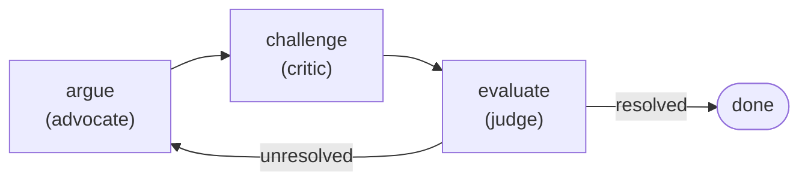
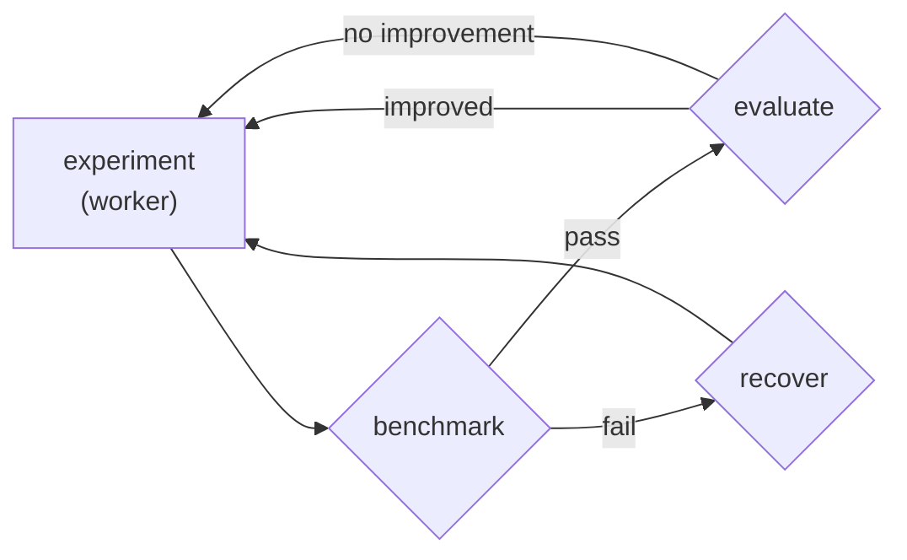

# pi-relay

**Plan. Execute. Verify.**

Finite state machine workflows for [pi](https://pi.dev/). Agents act, Relay verify.

```bash
pi install https://github.com/benaiad/pi-relay
```

Or install manually:

```bash
# Copy
cp -r . ~/.pi/agent/extensions/pi-relay/
cd ~/.pi/agent/extensions/pi-relay && npm install --omit=dev

# Or symlink (changes take effect immediately)
ln -s "$(pwd)" ~/.pi/agent/extensions/pi-relay
```

Two tools are added to pi:

- **`relay`** — the model builds a plan from scratch: steps, actors, artifacts, verification gates.
- **`replay`** — the model runs a saved plan template by name with arguments.

Type `/relay` to browse installed actors and templates.

## How it works

1. The model calls `relay` (ad-hoc plan) or `replay` (saved template) based on the task.
2. The plan is compiled — actor references, route targets, and artifact contracts are validated.
3. You review the plan and choose: **Run**, **Refine**, or **Cancel**.
4. The scheduler executes steps sequentially. Action steps spawn isolated agent subprocesses. Check steps run shell commands and route on exit code — pass or fail, no interpretation.
5. The run report shows what happened: per-step outcomes, tool calls, and actor transcripts. Press `Ctrl+O` to expand the full step-by-step detail.

Use `/relay` to browse installed actors and templates.

## Included templates

Five templates ship with the extension. Each implements a different workflow topology — from a single gate to multi-round adversarial loops. The model picks the right one via `replay`, or builds a custom plan with `relay`.

### verified-edit

The simplest useful topology: do the work, then prove it didn't break anything.


**Parameters:** `task`, `verify`

```
Use replay with the verified-edit template:
  task: Add input validation to the signup handler in src/api/signup.ts
  verify: npm test
```

### bug-fix

Diagnosis before code changes. The worker writes a structured root-cause analysis to an artifact, then reads it back when fixing. No "let me just try something."


**Parameters:** `bug`, `verify`

```
Use replay with the bug-fix template:
  bug: Login returns 500 when email contains a + character
  verify: npm test -- --grep auth
```

### reviewed-edit

Two-pass review with a fix loop. Spec compliance first, code quality second. Reviewers run in fresh contexts — no memory of the implementation reasoning, so they evaluate the code as-is.


**Parameters:** `task`, `criteria`, `verify`

```
Use replay with the reviewed-edit template:
  task: Add rate limiting to the /api/upload endpoint
  criteria: Returns 429 after 10 requests per minute per IP. Includes Retry-After header.
  verify: npm test && npm run lint
```

### multi-gate

Three sequential verification gates with per-gate failure reporting. Use instead of `verified-edit` when you need to know exactly which gate failed — a compound `lint && tsc && test` command hides which step broke.


**Parameters:** `task`, `gate1`, `gate1_name`, `gate2`, `gate2_name`, `gate3`, `gate3_name`

```
Use replay with the multi-gate template:
  task: Refactor the config parser to use Zod schemas
  gate1: npm run lint
  gate1_name: lint
  gate2: npx tsc --noEmit
  gate2_name: typecheck
  gate3: npm test
  gate3_name: test
```

### debate

Structured adversarial debate between three actors. The advocate defends a position, the critic attacks it, and the judge decides whether the question is resolved or needs another round. The loop runs up to `max_rounds` iterations.



**Parameters:** `topic`, `position`, `max_rounds`

```
Use replay with the debate template:
  topic: Should we migrate from REST to GraphQL for the users API?
  position: Yes — GraphQL eliminates overfetching and simplifies the mobile client.
  max_rounds: 3
```

### autoresearch

An autonomous optimization loop. The agent modifies code, the runtime benchmarks it, a deterministic gate keeps improvements and reverts regressions. Included as an example in [`examples/autoresearch/`](examples/autoresearch/) — see its README for setup.



**Parameters:** `target`, `goal`, `benchmark`, `evaluate`, `recover`, `max_experiments`

## Custom templates

The five bundled templates work out of the box. To add your own or override a bundled one, place `.md` files in:

- **User scope:** `~/.pi/agent/pi-relay/plans/` — available in all projects
- **Project scope:** `<project>/.pi/pi-relay/plans/` — available only in that project

A custom template with the same `name:` as a bundled one shadows it. Project scope shadows user scope. Example:

```markdown
---
name: my-workflow
description: "What this does and when to use it."
parameters:
  - name: task
    description: What to implement.
    required: true
  - name: verify
    description: Shell command that must exit 0.
    required: true
---

task: "{{task}}"
entryStep: implement
artifacts: []
steps:
  - kind: action
    id: implement
    actor: worker
    instruction: "{{task}}"
    reads: []
    writes: []
    routes: [{ route: done, to: verify }]
  - kind: verify_command
    id: verify
    command: "{{verify}}"
    onPass: done
    onFail: failed
  - kind: terminal
    id: done
    outcome: success
    summary: Done.
  - kind: terminal
    id: failed
    outcome: failure
    summary: Verification failed.
```

Check commands run through pi's shell backend (respects `shellPath` in settings, defaults to `/bin/bash` on Unix, Git Bash on Windows). Integer and boolean parameters are coerced automatically.

## Actors

Actors define the roles that execute plan steps. Five ship with the extension:

- **worker** — implements changes (read, edit, write, grep, find, ls, bash)
- **reviewer** — reviews against criteria, read-only (read, grep, find, ls, bash)
- **advocate** — argues a position in a debate (read, grep, find, ls)
- **critic** — challenges arguments in a debate (read, grep, find, ls)
- **judge** — evaluates debate rounds and delivers verdicts (read, grep, find, ls)

To add custom actors or override a bundled one, place `.md` files in:

- **User scope:** `~/.pi/agent/pi-relay/actors/` — available in all projects
- **Project scope:** `<project>/.pi/pi-relay/actors/` — available only in that project

Same shadowing rules as templates. Example:

```markdown
---
name: security-auditor
description: Scans code for security vulnerabilities
tools: read, grep, find, ls
---

You are a security auditor. Read the code carefully and report
any vulnerabilities, focusing on injection, auth bypass, and
data exposure.
```

Edits to actor system prompts take effect on the next execution. Adding or removing actors requires `/reload`.

## Plan review

When a plan can modify files or run commands, pi shows a review dialog before execution:

- **Run the plan** — execute as described
- **Refine** — provide feedback; the model revises and resubmits
- **Cancel** — abort without executing

Read-only plans skip the dialog.

## Development

```bash
git clone https://github.com/benaiad/pi-relay.git
cd pi-relay && npm install && pi install .
npm test
```

## License

MIT
